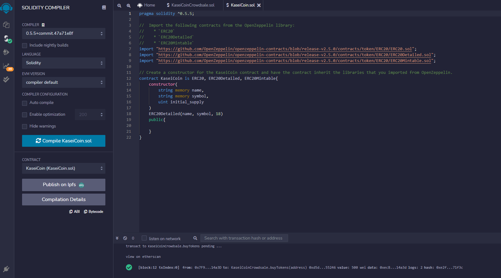
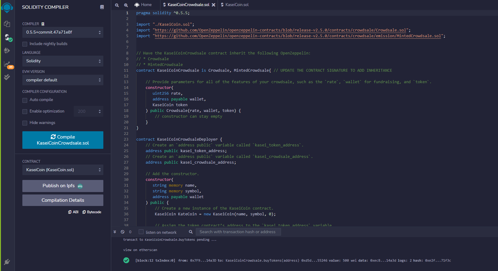
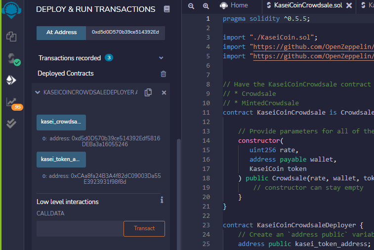
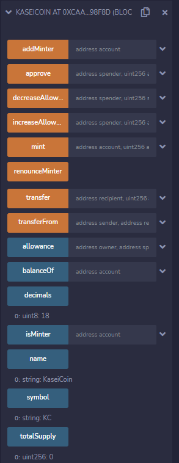
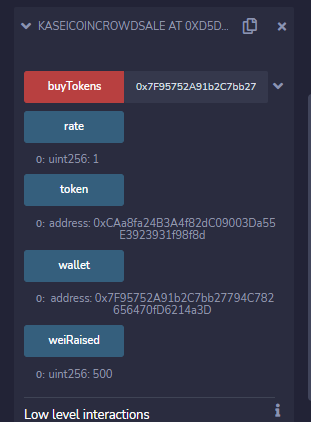

# Last Homework!
## In my final act I have compiled two smart contracts, one to create a fungible coin that is ERC-20 compliant and the second to mint said coin with Solidity.
### Evaluation Evidence

No issues when compiling KaseiCoin contract.

The second contract I entered the paramaters to ad the features in the contract. When attempting to compile the crowdsale contract I was getting an error on the pragma compiler so my tutor suggested using pragma 0.5.5.

Next I deployed the crowdsale contract and entered in the address for the token to be dispersed from.

Finally I tested the contracts ability to buy new tokens. I verified the functionality of the token buy using the buy token button and confirming through MetaMask. Below you can see the buttons are accurate and the blockain is functional. I have raised 500 wei.
 
